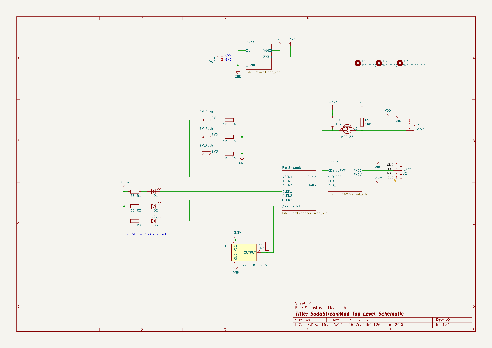
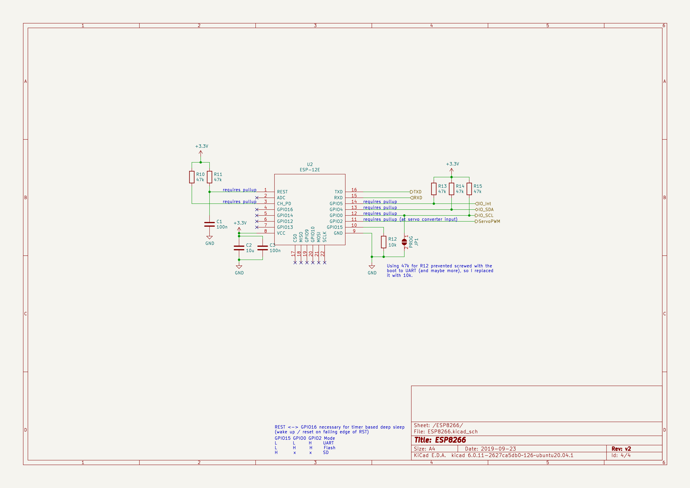
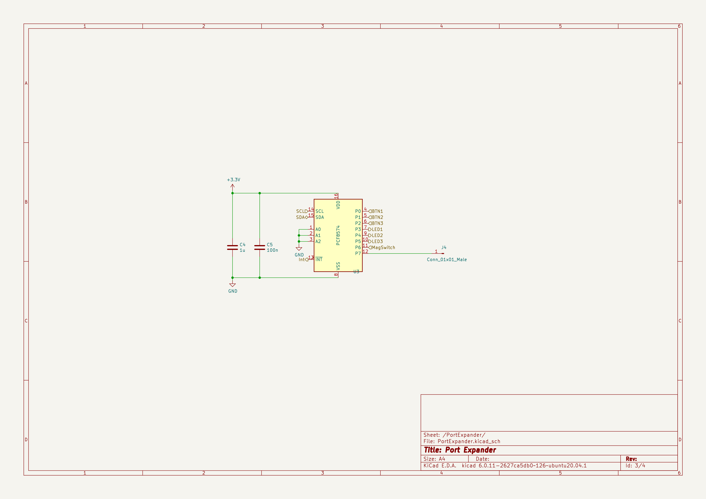
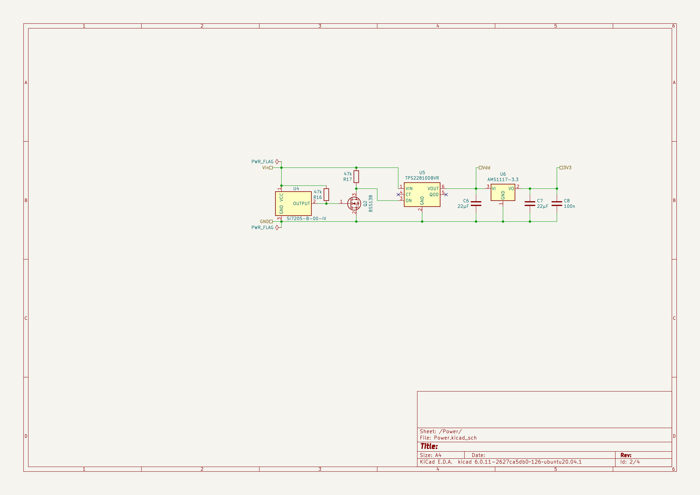
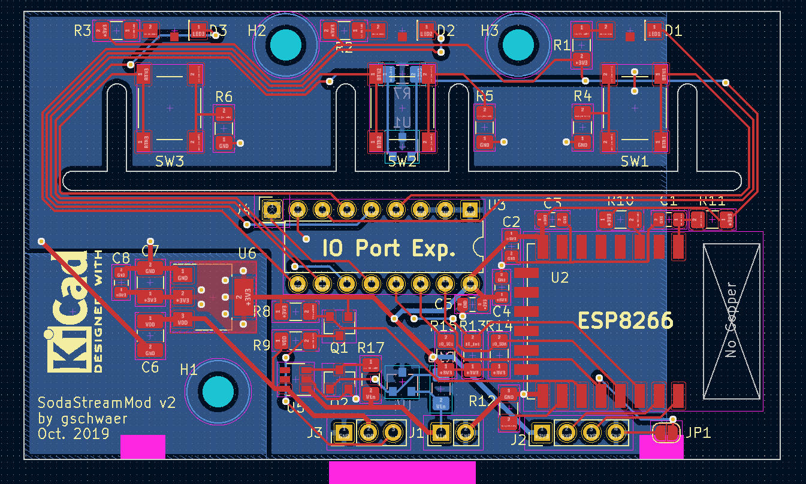
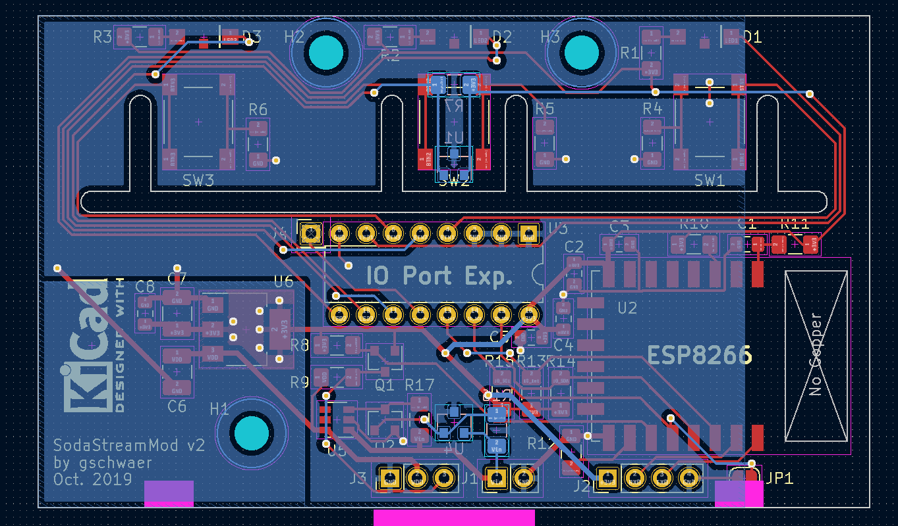
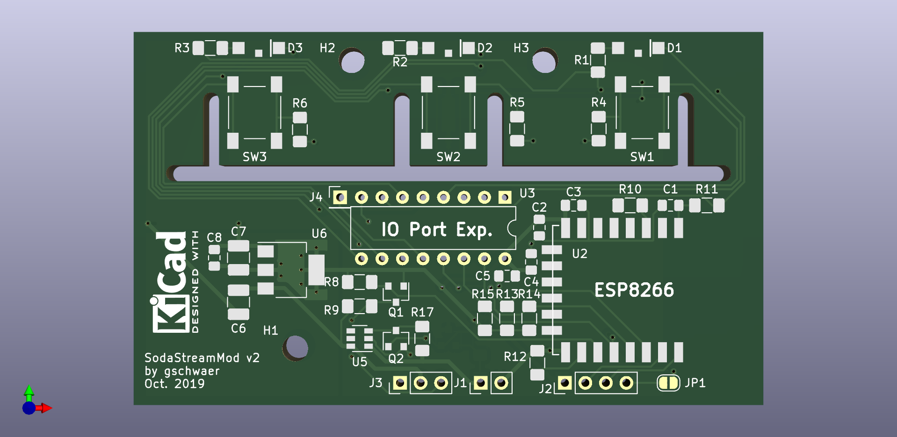

# SodaStream Power Mod

> Because the Internet of Things needed a smart soda maker.

There is (or was) a soda maker called "SodaStream Power". It has some buttons and LEDs and uses a servo to do the usual pushing motion that soda makers require. Mine was broken probably due to an [unfortunate design decision](#just-why--the-beginnings) (and me). So I thought: If I have to fix it by replacing the MCU either way, why not use a WIFI-enabled one? So I build a replacement PCB with an ESP8266. It even runs python! 😲

Disclaimer: It doesn't access the internet. But it could! -- But what for? Maybe I should blink the current time in morse code for each new soda, or add a cloud backend so I can better scale my soda making. 🤔😉

So what does it use WIFI for? Well, I can debug it remotely while it's standing in the kitchen. 😅

Otherwise it just does, well, make soda. Though I improved (imo) the [user interface](#ui-changes) a little.

> ℹ️ I did this project in 2019, but I rewrote the software and documentation in 2023, so some details might be lost to time.


## Hardware

The PCB was designed in KiCad and fabricated by JLCPCB in 2019.

Main components:
* MCU: `ESP8266-12F`
* I2C-Port-Expander: `PCF8574AN`
  * Note: The suffix `A` implies a different I2C base address than the version without the `A`. The non-`A` chip works as well (but needs a minor change in code). (Took me a few hours debugging before I realized I stared at the wrong data sheet.)
* 2x Hall Switch: `SI7205-B-00-IV`
* High Side Power Switch: `TPS22810DBVR`


### Known Design issues

1. In the first revision I made a mistake and wired the LEDs to $V_{in} = 6.5 V$ (with higher values for the current limiting resistor). I thought this way I could prevent wasting power in the $3.3 V$ regulator for the LED current. Yes, that was dumb, because the regulator is a linear regulator, so the resistor dumps the same amount of power. 🤦 But the LEDs wouldn't burden the regulator at least. Anyway, the actual problem was that the port expander did not have open drain ports. Instead, ports are actively driven to low and high ($3.3V$), so in the "off" state, the LEDs (+Resistor) would see $6.5V-3.3V = 3.2V$ and would just be dimmer. 😬 I fixed it by cutting a trace and botching a wire to have the LEDs use the $3.3V$ supply rail. I'm still using that version to date. In the KiCad project that mistake has been fixed. But I didn't reorder a PCB, so that change is untested.
2. I used the least sensible GPIOs (GPIO 0, 2) for IO. It worked ok in the end, though I later had a minor issue in micropython with PWM on GPIO2 after a soft reset, because GPIO2 is a boot select pin. But I was able to fix that in software and either way: in regular operation we don't soft reset.
3. I placed some components and traces beside the antenna. Probably not good, but works ok. There is unfortunately not much space for traces around this huge center cutout.


### Schematics

> ⚠️ Warning: The [KiCad project](./PCB/Sodastream/) was converted from an older KiCad version. I'm not sure if that worked ok.

For ease of use I made some screenshots of the schematics.







### Layout

I measured the holes and cutouts on the original PCB and used identical ones on my PCB so it fits in the PCB holder. The pink areas are markings for special locations in the PCB housing: Left and right areas are keep out zones for the housing's snap fit hooks. The area in the center marks where the cabling leaves the water-proof housing.






## Software

This project uses [micropython](https://github.com/micropython/micropython/) version `1.20.0` installed as per the [documentation for ESP8266](https://docs.micropython.org/en/v1.20.0/esp8266/quickref.html). Here's the command I used:
```bash
esptool.py --port "${DEV}" --baud 460800 write_flash --erase-all --flash_size=detect 0 ESP8266_GENERIC-20230426-v1.20.0.bin
```
The code in [`./src`](./src/) is compiled with `make`. You need `mpy-cross`, `pyboard.py`, and `gcc` (see [`Makefile`](./src/Makefile)).

After that we can upload the code with [micropython's `pyboard.py` tool](https://docs.micropython.org/en/v1.20.0/reference/pyboard.py.html). The configs [`./src/webrepl_cfg.py`](./src/webrepl_cfg.py) and [`./src/wifi_cfg.py`](./src/wifi_cfg.py) require some adjustments.

After that, you can access the board via WiFi in the browser at http://192.168.0.123:8266/ (or which ever IP your board got, mDNS would be an improvement here, see [Future Work](#future-work)).


### UI Changes

Iirc the vendor UI was very basic: We have 3 buttons and 3 LEDs, when you insert a bottle all LEDs light up. Then you press one of the buttons, you get a low, medium, or high dose of CO2 into the bottle. The different doses are solely achieved by opening the CO2 valve for different, fixed durations.

Of course, that is reasonable, but it's actually a not much of an improvement compared to the manual soda makers. The main drawbacks are:
1. You still need to press a button,
2. when the CO2 cylinder empties, its pressure drops. This means the simple relationship between the duration of opening the valve and the applied CO2 dose does not hold anymore.

Drawback 1. is easily mitigated by beginning to open the CO2 valve as soon as a bottle is inserted. This means I cannot select the dose beforehand. This can be remedied by allowing a change of the dose *during* the operation. (This change is only in effect for the current soda making.)

I solved drawback 2. by tracking the cylinder state. I redefined the buttons to mean *left = "less CO2"*, *right = "more CO2"* (*center = "abort/restart"*). If a selection is made after the soda making is done, it is saved for next time. So when the CO2 cylinder empties, I can adjust the valve opening duration step by step whenever a bottle is not pressured to the degree I want. I also added some more subtle functions, and a debug mode:

| Button | Held Down Before*             | Pressed While   | Pressed After    |
|--------|-------------------------------|-----------------|------------------|
| left   | (+right) reset cylinder state | less CO2 (temp) | less CO2 (saved) |
| right  | (+left) reset cylinder state  | more CO2 (temp) | more CO2 (saved) |
| middle | debug mode (WiFi)             | abort           | start again      |

Table: Effect of buttons (1) held down while inserting a bottle, (2) pressed while the soda making happens, and (3) pressed after the soda making is completed. (* If any button is held down while a bottle is inserted, the CO2 valve stays closed. So resetting the cylinder state and entering debug mode can be done without wasting CO2.)

### Issues

I ran into some issues:

WebREPL:
* It's annoying to figure out the boards IP address. I currently check my router. But mDNS would be an obvious improvement.
* I regularly forget that when logging in via WebREPL, my python code is still running. Remember: after logging in, do `ctrl+c` to end the running program.

Boot Time:
* Boot time increases every time you overwrite a python file that is loaded at boot! I assume that has something to do with the flash filesystem trying to prevent wear. Maybe it does some copy-on-write with a linked list to traverse to the latest valid chunk? idk
  * If I remember correctly (! I didn't confirm it again !), you can reset this behavior by reformatting the flash (after that you have to reupload all files):
    ```python
    import uos
    from flashbdev import bdev
    uos.VfsLfs2.mkfs(bdev)
    vfs = uos.VfsLfs2(bdev)
    uos.mount(vfs, "/")
    ```
* I am using the following boot flow: `boot.py` -...-> `main.py` -> `sprudler.mpy`. That is mainly because `boot.py` and `main.py` cannot be compiled `.mpy` files. In `boot.py` I only put everything that I want done ASAP and `main.py` only `import`s the compiled `.mpy` file. I experimented a lot while trying to bring down boot time. I did not save the experiment results, but this solution got the best results for my use-case.
* The servo has three positions: (1) valve closed & bottle unlocked, (2) valve closed & bottle locked, (3) valve open & bottle locked. In `boot.py` I move the servo to the second (2) position. While the servo is moving to that position, we load the rest of the software and regular operation begins. This reduces the effective delay until operation begins.
* To optimize the compiled `.mpy` file, I experimented with regular global constants, constants marked with `const()`, and plain inserted constants. I'm not entirely sure what worked best, because while experimenting I also stumbled upon the issue above. Iirc boot time was best with inserted constants. So I stuck with that and added a preprocessor step using regular C preprocessor defines like `#define MY_CONST 123` in `sprudler.py`. (They get slightly garbled by the `black` formatter, but meh, I just undo this in the `Makefile`. Not elegant but works ok.)

WiFi AP:
* The WiFi AP does not work on my board with micropython `1.20.0`, so I disabled it (see [issue](https://github.com/micropython/micropython/issues/9226#issuecomment-1718269312)).
  * To prevent the board from boot looping after flashing, connect via serial and spam-paste the following into the terminal (including the newline):
    ```
    import network; network.WLAN(network.AP_IF).active(False)

    ```
    After some tries it will hit after the REPL becomes ready but before the AP is set up and the boot loop stops.

PWM:
* The servo is twitching if WiFi is enabled: The ESP8266 does not have hardware PWM outputs, so micropython does software PWM. WiFi will add a lot of load, which adds occasional lag on the software PWM timer handler. Ok for me, I only use WiFi in debug mode, where I can live with some servo twitching.


## Just Why?! / The Beginnings

Why am I doing this? Well, the electronics of my soda maker "broke", here's what happened:

The original circuitry has a tilt switch. It is just a conductive ball resting on two parallel wires, thus shorting the connection. The whole thing is in a black rectangular plastic housing with enough head room so the ball can slightly move upwards. If the PCB is flipped upside down the ball will fall away from the wires (now an open circuit) and the MCU will register that.

It turns out, if the device is on, you flip it upside down, and press any button, the MCU will go into an error state and blink the LEDs. Okay fine, maybe we just don't want our precious soda on the floor. But there is **no** way to get out of this error state! Not power cycling, no combination of button presses, short and long presses, with or without a bottle inserted, I tried everything I could think of. So ... this device just bricks itself? 🙃

Side note: If you are that kind of person (like me) who wants to know how devices work, and like to open them up to find out, you sometimes move parts aside, like for example **the PCB**, and maybe even let it dangle **upside down** on the side since the cables are so short...

However, I cannot be 100% certain that this is what bricked it. But there is a tilt switch on the PCB, it's connected to the controller, and the device went into the error state once I operated it with the PCB hanging upside down. But it could have been something else I did, who knows.

Why would the manufacturer do that? Not sure, maybe it is due to a regulation? CO2 in compressed gas cylinders is actually liquid. So from what I read, if you operate the valve while the CO2 cylinder is upside down it will spill the liquid CO2 which is very cold due to the drop in pressure. Maybe they wanted (or had) to prevent this hazard. (But why permanently!?)


## Future Work

- Add mDNS, so I don't need to look up the IP address.
  - https://github.com/vaudric/micropython/tree/main/mdns
  - https://github.com/nickovs/slimDNS
- Measure bottle pressure with a pressure sensor?
